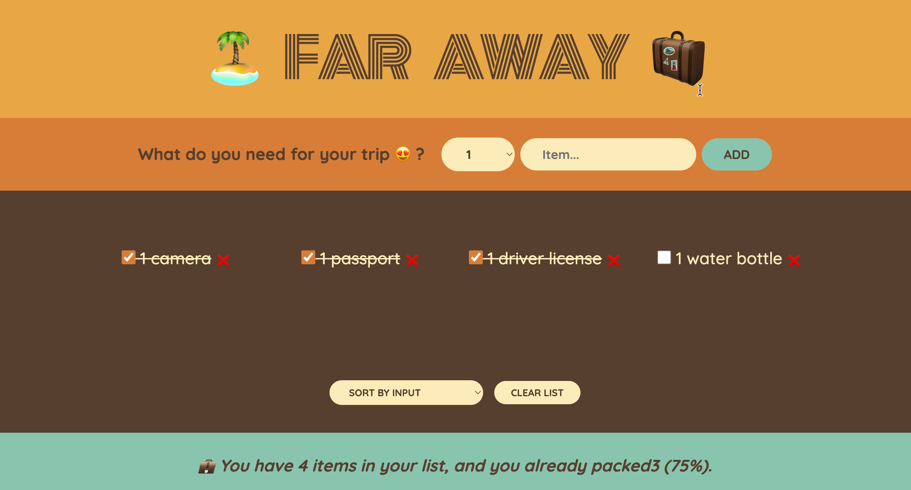

🎒 Travel List

Travel List is a web application that helps you manage your packing list for travel. It's implemented using React and provides functionalities to organize and track items in your packing list.

🚀 Features

Packing List Management: Add, edit, and manage items in your packing list through an intuitive interface.
Item Details: Manage individual items with options to edit or delete.
Statistics View: View statistics related to your packing list, such as total items, checked items, etc.
Responsive Design: Adapts to various screen sizes for a seamless user experience.

🎮 How to Use

Add Items: Use the provided form to add items to your packing list.
Edit Items: Click on an item to edit its details.
Check Items: Mark items as checked once packed.
View Stats: Access the statistics view to see a summary of your packing list.

💻 Setup and Running

Install Dependencies: Run npm install to install all required dependencies.
Start the Application: Run npm start. The application will be accessible at http://localhost:3000 or your network IP at port 3000.
Open the App: Open the provided URL in your preferred browser.

